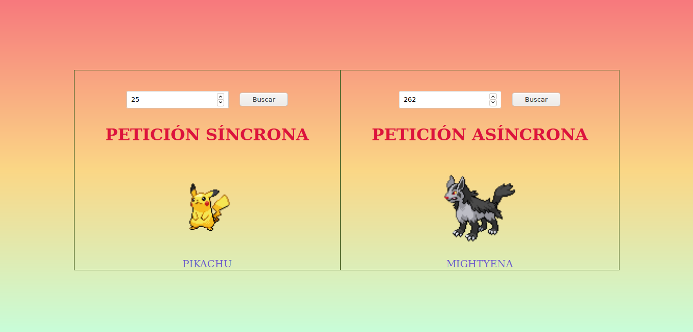

<h1 align="center">XMLHTTPRequest</h1>

💻 Objeto javascript para que se usaba para hacer peticiones.

🚫 <i>Actualmente se usa fetch o axios para realizar peticiones</i>

## Api

[PokéApi](https://pokeapi.co/)

## CONTRIBUTORS ✨

<table>
  <tr>
    <td align="center"><a href="https://github.com/wilderPariona"> <b>Wilder Pariona</b></a></td>
  </tr>
</table>
